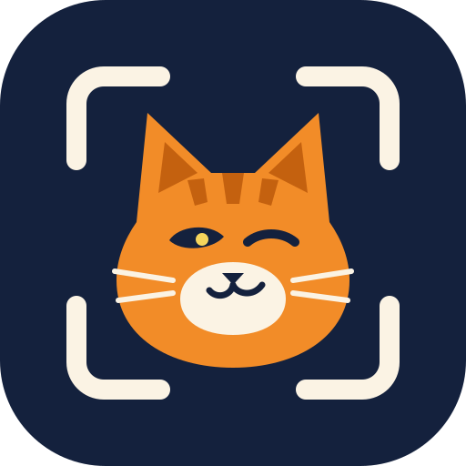

# Cat Me If You Can · Kadıköy 🐾



**„Catch me if you can“ → „Cat me if you can“.** Ein Handyspiel, bei dem man die
Straßenkatzen von Kadıköy fotografiert und „fängt“, ähnlich wie bei Pokémon GO. Jede Katze wird
per KI analysiert: Typ/Rasse, Alter, Gewicht, Ernährungszustand, Kastrationsmarke am Ohr und
Gesundheit. Danach landet sie mit Ort und Zeit im **KediDex**, der Sammlung (*kedi* = Katze).
**20 verschiedene Katzen an einem Tag = 20 % Rabatt** in einem teilnehmenden Café, gültig an
genau diesem Tag. Nebenbei entsteht ein laufender **Zensus der Straßenkatzen** mit Karte,
Zustand, Statistik und einem Hilfe-Radar für Freiwillige.

Alles läuft auf Türkisch, Deutsch und Englisch. Das ausführliche Konzept (Spielmechanik,
Partnermodell, Geschäftsmodell, Ausbau auf weitere Stadtteile, Namensideen) steht in
[docs/KONZEPT.md](docs/KONZEPT.md). Wie ein Café mitmacht:
[docs/PARTNER.md](docs/PARTNER.md).

## Schnellstart

```bash
cd catmeifyoucan
CATME_DEMO=1 node server.js        # → http://127.0.0.1:8790  (mit Demo-Katzen und Demo-Cafés)
```

Es gibt keine Pflicht-Abhängigkeiten, Node ≥ 20 reicht. Die KI-Analyse ist optional:

```bash
npm install                        # holt u. a. @anthropic-ai/sdk (optional)
export ANTHROPIC_API_KEY=sk-ant-…
CATME_DEMO=1 node server.js        # Analyse: Claude (claude-opus-5-5)
```

Ohne Key läuft die **einfache Analyse**: Sie erkennt das Fellmuster aus den Farben des
Ausschnitts, schätzt aber kein Alter, Gewicht oder Gesundheit. Die Karte sagt das auch so.

| Seite | Für wen |
|---|---|
| `/` | Spieler:innen – Heute, KediDex, **Fangen**, Karte, Kadıköy-Statistik, Profil |
| `/partner.html` | Café-Personal – Gutschein scannen/eintippen, prüfen, einlösen (Demo-PIN `246810`) |
| `/admin.html` | Moderation – Dubletten, Einsprüche, auffällige Fänge, Cafés, Rollen, Legenden (Token in `data/admin-token.txt`) |
| `/?demo=1` | Reiner Browser-Demo-Modus ohne Server (Daten nur im Browser) |

### Mit dem Handy testen

Kamera und GPS gibt es im Browser nur über **HTTPS** (oder `localhost`). Zum Beispiel so:

```bash
HOST=0.0.0.0 node server.js
cloudflared tunnel --url http://localhost:8790      # oder: ngrok http 8790
```

Oder mit eigenem Zertifikat (`mkcert`): `CATME_TLS_CERT=cert.pem CATME_TLS_KEY=key.pem HOST=0.0.0.0 node server.js`.
Außerhalb von Kadıköy wird ein Fang mit „außerhalb des Spielgebiets“ abgelehnt. Im Demo-Modus
(`/?demo=1`) wird der Standort automatisch nach Moda simuliert.

## So funktioniert ein Fang

```
Kamera (Rückkamera) ─► AR-Sucher: COCO-SSD erkennt die Katze im Bild (läuft im Handy)
        │                Rahmen rastet ein, Auslöser pulsiert
        ▼
 Wollknäuel-Wurf 🧶 ─► Foto (≤1280 px) + Ausschnitt um die Katze (≤512 px) + Fingerabdruck
        │               (Fellfarben + dHash) + GPS (Genauigkeit) + Zeitpunkt
        ▼
 Server: Vorprüfungen ─► Spielgebiet · 20-s-Abklingzeit · gleiches Foto schon benutzt? ·
        │               Foto frisch? · GPS genau? · unmögliche Reisegeschwindigkeit?
        ▼
 Analyse (Claude) ───► Katze? echtes Foto (kein Bildschirm)? Straßenkatze (keine Hauskatze)?
        │               Fellmuster · Rasse-Tipp · Alter · Gewicht · BCS 1–9 · Geschlecht ·
        │               Ohrmarke (kastriert) · Gesundheit + Dringlichkeit · Verhalten · Merkmale
        ▼
 Wiedererkennung ────► Kandidaten im Umkreis 450 m · Farbe/Muster/Entfernung/Widersprüche ·
        │               unsicher → Claude vergleicht die Fotos · sonst „neu“ + Prüfliste
        ▼
 Sammelkarte ────────► NEUE KATZE → Erstfinder:in gibt den Namen (Wortfilter + KI-Prüfung)
                        XP · Tagesziel 20 · Tagesaufgaben · Abzeichen · Gesundheit → Hilfe-Radar
```

Das Tagesziel zählt **verschiedene** Katzen am selben Tag in Istanbul-Ortszeit.
Galeriefotos werden erfasst, zählen aber nicht. Ab dem Ziel holt man sich einen Gutschein
(`CAT-XXXX-XXXX` + QR-Code, laufende Uhr gegen Screenshots). Er gilt bis 23:59 Uhr und lässt
sich genau einmal einlösen.

## Architektur

```
public/                 alles, was der Browser lädt (auch statisch hostbar → Demo-Modus)
  config/regions.js     Spielgebiete: Kadıköy-Polygon, 21 Mahalle (weitere Stadtteile = neuer Eintrag)
  config/game.js        Regeln: Tagesziel, Abklingzeit, XP, Level, Abzeichen, Tagesaufgaben
  core/                 Spiel-Engine – identisch im Server und im Browser
    engine.js           Fangen, Spieler:innen, Heute/Profil/Sammlung
    reid.js             Wiedererkennung      fingerprint.js  Fellfarben + dHash
    analysis.js         Schema + Normalisierung der KI-Analyse, einfache Analyse
    moderation.js       Namensfilter (TR/DE/EN/FR/ES/IT/NL/PL/RU/AR/EL, gegen 1337-Schrift)
    census.js           Katzenliste, Profil, Status, Hilfe, Orte, Karte
    vouchers.js         Gutscheine        admin.js   Moderation     stats.js  Statistik/Ranglisten
    store.js            Datenspeicher (Schnittstelle: get/insert/update/where/all)
  js/                   Oberfläche (ES-Module, keine Build-Schritte)
server/                 Node-HTTP-Server ohne Framework
  app.js                Routen, Rechte, Ratenbegrenzung, CSP
  analyzer-claude.js    Claude: Analyse + Foto-Vergleich (Structured Outputs, Fallbacks)
  moderator-claude.js   Claude: Namensprüfung in jeder Sprache
  journal.js            Persistenz: JSONL-Journal + Snapshot (data/)
  photos.js             Fotos: ganzes Bild privat, nur Ausschnitt öffentlich
```

Gespeichert wird in `data/` (`snapshot.json`, `journal.jsonl`, `photos/`). Das reicht für
einen Bezirk mit einigen tausend Katzen. Für mehr Last baut man `public/core/store.js` gegen
Postgres/PostGIS nach, die Engine bleibt dabei unverändert.

### Konfiguration

| Variable | Standard | Bedeutung |
|---|---|---|
| `PORT` / `HOST` | `8790` / `127.0.0.1` | `HOST=0.0.0.0` fürs WLAN |
| `CATME_DATA` | `./data` | Datenordner |
| `CATME_AI` | `auto` | `auto` · `claude` (Pflicht) · `off` · `mock` (Tests) |
| `CATME_MODEL` | `claude-opus-5-5` | Modell für Analyse, Vergleich, Namensprüfung |
| `CATME_DEMO` | – | `1` = Demo-Daten anlegen (nur bei leerem Speicher) |
| `ADMIN_TOKEN` | erzeugt | sonst `data/admin-token.txt` |
| `TRUST_PROXY` | – | `1` hinter nginx/Caddy/Cloudflare |
| `CATME_TLS_CERT` / `CATME_TLS_KEY` | – | HTTPS direkt |
| `CATME_TILES` / `CATME_TILES_ATTRIB` | OSM | eigener Kartenkachel-Dienst (für echten Betrieb nötig) |

Regeln lassen sich ohne Code anpassen: `data/game.override.json`, z. B.
`{"dailyGoal": 15, "catchCooldownSec": 30}`.

**KI-Kosten (Richtwert):** Pro Fang gibt es eine Anfrage mit zwei Bildern (≈ 2 000
Eingabe-Token + Antwort). Mit `claude-opus-5-5` liegt das grob bei 2–5 US-Cent. Dazu kommen
gelegentlich ein Foto-Vergleich und Namensprüfungen. Bei 1 000 Fängen am Tag sind das etwa
20–50 $. Ein günstigeres Modell lässt sich mit `CATME_MODEL` einstellen.

### Daten & Tierschutz

* Öffentlich sind nur der **Katzen-Ausschnitt** und auf **~100 m gerundete** Positionen. So
  kann niemand eine Katze auf den Meter genau aufspüren. Das ganze Foto (mit möglichen
  Menschen oder Kennzeichen) sieht nur die Moderation.
* Spitznamen statt Klarnamen, kein Passwort; das Gerät bekommt ein zufälliges Token.
* Offene Daten für Tierschutz und Verwaltung: `/api/export/cats.csv` und `/api/export/cats.geojson`.
* Die Regeln im Spiel: nicht jagen, nicht anfassen, kein Blitz, nur Straßenkatzen.

## Tests

```bash
npm run test:unit     # Kern, Engine, API, Claude-Anbindung (mit Attrappe) – node --test
npm run test:e2e      # Chromium: Fake-Kamera mit echtem Katzenfoto → AR → Fang → Name →
                      # Gutschein → Café löst ein → Moderation → Demo-Modus
```

Die AR-Erkennung im E2E-Test lädt das COCO-SSD-Modell aus dem Netz. Hinter einem
TLS-abfangenden Proxy hilft `E2E_IGNORE_TLS=1`.
